# Flutter チュートリアル

flutter & riverpod & flutter_hooks のチュートリアル

---
layout: summary
---

## はじめに

本チュートリアルではFlutterの初心者がRiverpod・FlutterHooksを使用し、
フロントエンドアプリケーションを開発できるようになることを目的とします。

<div grid="~ cols-2 gap-4">

<div>

また、以下の点を前提としていることに留意してください。

- Flutterの環境構築を行っている\
  [Flutterの公式](https://docs.flutter.dev/)などを見ながら環境構築を行ってください
- プログラミング言語の基礎的な文法を理解している\
  Dart特有の文法などは知っている必要はありません\
  ([Effective Dart](https://dart.dev/effective-dart)を読むと特有の書き方を知れます)

</div>
<div>

<div style="display: flex; justify-content: center;">


</div>
<br/>
<div style="display: flex; justify-content: center;">

</div>

</div>
</div>

<br/>

また、実際にコードを書いて<span v-mark.underline.orange>どこに何を書くとどうなるかという試行錯誤をしながら学ぶ</span>ことを推奨します。

---
layout: summary
---

## はじめに: VSCodeの場合

<div grid="~ cols-2">

<div>

以下の拡張機能をインストールしてください。

- 必須
  - [Dart](https://marketplace.visualstudio.com/items?itemName=Dart-Code.dart-code)
  - [Flutter](https://marketplace.visualstudio.com/items?itemName=Dart-Code.flutter)
- おすすめ
  - パス入力の補完：[Path Intellisense](https://marketplace.visualstudio.com/items?itemName=christian-kohler.path-intellisense)

<div style="font-size: 14px;">

<br/>

また、複数人で管理されているコードであれば `.vscode/extensions.json`ファイルに従って推奨されている拡張機能を適宜インストールしてください。

<div style="font-size: 12px;">
Extensionsタブを開き(Ctrl+Shift+X)、「@recommended」で検索すると推奨されている拡張機能が一覧で見れます。
</div>

</div>

</div>

<div>

<br/>

<a href="https://marketplace.visualstudio.com/items?itemName=Dart-Code.dart-code"></a>
<a href="https://marketplace.visualstudio.com/items?itemName=Dart-Code.flutter"></a>
<a href="https://marketplace.visualstudio.com/items?itemName=christian-kohler.path-intellisense"></a>


</div>

</div>


---
layout: section
---

## Widgetの基本


---

### WidgetによるUI構築

Flutterでは`Widget`というクラスを使用してUIの構成要素を指定して画面を描画します。\
`Widget`というのは`Text`や`Checkbox`、`Column`や`Row`などUI構造や要素など、<span style="text-decoration-line: underline; text-decoration-color: cyan;">UIを構成するパーツ</span>を指します。\
UIの描画は、以下のように`Widget`をツリー状に配置することで、Flutterが自動で行ってくれます。

<div grid="~ cols-2 gap-4">

<div style="text-align: center;">

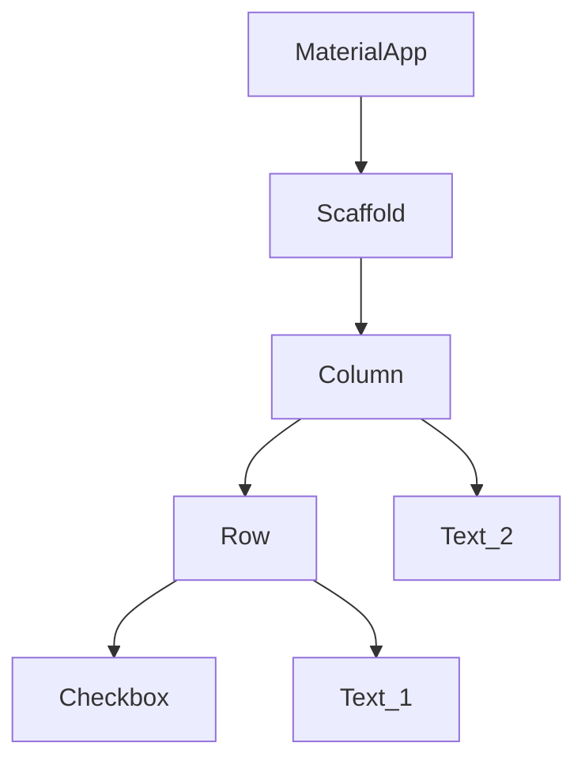

</div>

<div>

```dart {4-17}
class MyApp extends StatelessWidget {
  const MyApp({super.key});
  Widget build(BuildContext context) {
    return MaterialApp(
      home: Scaffold(
        body: Column(children: [
          Row(children: [
            Checkbox(
              value: true,
              onChanged: (value) {},
            ),
            Text('sample text1'),
          ]),
          Text('sample text2'),
        ],
      )),
    );
  }
}
```

</div>
</div>

---

### Widgetを使用してアプリケーションを実行する

dart言語も他の言語と同じで、最初に`main`関数が呼び出されます。\
この`main`関数で`runApp`関数に用意されている`Widget`を渡すことで、作成した`Widget`を基にアプリケーションが実行されます。

<div grid="~ cols-2 gap-4">

<div>

<CodeCaption>main関数のサンプルコード</CodeCaption>

````md magic-move {duration: 1}
```dart
void main() {
  runApp(
    // step1: マテリアルデザインのために、まずはMaterialAppを渡す
    const MaterialApp(
      home: ...,
    ),
  );
}
```
```dart
void main() {
  runApp(
    MaterialApp(
      // step2: 各Widgetを配置してUIを構築する
      home: Scaffold( // 土台を置く
        appBar: AppBar( // アプリの上部バーを表示
          title: const Text('Sample'),
        ),
        body: const Center( // 中央に配置
          child: Text('sample'), // 「sample」という文字を表示
        ),
      ),
    );
  );
}
```
````

</div>

<div>

用意されているUIのパーツは[公式](https://docs.flutter.dev/ui/widgets)で見ることができます。\
レイアウトやMaterial ComponentsなどのUIのパーツがあり、\
便利なものも多いため活用してください。\
個別のWidgetの詳細はここでは解説しません。


</div>
</div>


---

### StatelessWidgetでWidgetを自作する

全て`runApp`に直接記述するのは現実的でないため、自分である程度の単位に分割した`Widget`を作成していきます。\
自分で`Widget`を作成するには、基本的には`StatelessWidget`を継承して`Widget`を作成し、画面を構築していきます。\
分割して作成した`Widget`は使い回すことで、コードの重複を減らすことができます。

<div grid="~ cols-2 gap-4">

<div>

````md magic-move
```dart
// step1: StatelessWidgetを継承したクラスを定義
class MyTextWidget extends StatelessWidget {
  const MyTextWidget({super.key});

  @override
  Widget build(BuildContext context) {
    return Text('sample'); // シンプルに文字を表示するWidgetを配置
  }
}
```
```dart {8-}
class MyTextWidget extends StatelessWidget {
  const MyTextWidget({super.key});
  @override
  Widget build(BuildContext context) {
    return Text('sample');
  }
}
// step2: 別のWidgetも定義する
class SampleWidget extends StatelessWidget {
  const SampleWidget({super.key});
  @override
  Widget build(BuildContext context) {
    return Scaffold(
      body: const Center(
        child: Placeholder(),
      ),
    );
  }
}
```
```dart {1,7,14-15}
class MyTextWidget extends StatelessWidget {
  const MyTextWidget({super.key});
  @override
  Widget build(BuildContext context) {
    return Text('sample');
  }
}
class SampleWidget extends StatelessWidget {
  const SampleWidget({super.key});
  @override
  Widget build(BuildContext context) {
    return Scaffold(
      body: const Center(
        // step3: 自作したMyTextWidgetを渡す
        child: MyTextWidget(),
      ),
    );
  }
}
```
```dart {12-}
class SampleWidget extends StatelessWidget {
  const SampleWidget({super.key});
  @override
  Widget build(BuildContext context) {
    return Scaffold(
      body: const Center(
        child: MyTextWidget(),
      ),
    );
  }
}
void main() {
  runApp(
    const MaterialApp(
      // step4: runAppにSampleWidgetを渡す
      home: SampleWidget(),
    ),
  );
}
```
````

</div>
<div>

左記のコードのように、用意されている`Widget`を使って`Widget`を自作し、別の`Widget`の中で使用していくことを繰り返して、最終的に一つのツリー状の画面を形成します。

</div>
</div>


---

### StatefulWidgetは使用しない

次に、画面に動的な変化を与えるようにしていきたいです。(例: 画面に表示する数字をボタンを押すことでカウントアップさせるなど)

`StatelessWidget`はその名の通り<span style="text-decoration-line: underline; text-decoration-color: cyan;">状態を持つことができない</span>ため、これだけでは画面を動的に更新することができません。\
そこで用意されているのが`StatefulWidget`です。\
`StatefulWidget`は`StatelessWidget`と違い、継承することで変数を管理して画面を動的に更新できるようになります。

<div style="display:flex;">

<div style="width:60%;">

しかし、これにはいくつも<span style="color: red;">欠点</span>があり、参考までに右に記載しておきます。

右記のような問題を解決するためにあるのが<span style="text-decoration-line: underline; text-decoration-color: cyan;">Riverpod</span>であり、\
本チュートリアルではRiverpodを使用します。\
そのため、`StatefulWidget`は存在の紹介をするだけにとどめます。

</div>
<div style="font-size: 14px; padding-left: 1em; opacity: 0.7; border: 1px solid gray;">

<div>欠点例</div>

- 状態の再利用性が低い\
  手動で親子間で変数の授受を行わなければならない
- 状態の永続化が困難\
  状態がWidgetと直接紐づいているため永続化しづらい
- 再描画効率の悪さ\
  setStateによって状態を更新すると、そのWidget全体が再描画される可能性がある
- 可読性の低下\
  Widget内部にロジックが書かれやすいため、可読性が悪くなりがちである
- ステートの解放が手動\
  disposeやinitStateを手動で行って初期化・解放する必要があり非効率
- テストが難しい\
  ロジックとUIが絡み合ってしまい、ユニットテストしづらい

</div>
</div>

---
layout: section
---

## Riverpod

---

### Riverpodとは

[Riverpod](https://riverpod.dev/ja/): Flutter(dart)のパッケージで、プロバイダーというものを使って、どの`Widget`からもアクセスできる状態を管理します。

<span style="text-decoration-line: underline; text-decoration-color: cyan;">状態とは、有り体に言えば「変数」です。</span>\
<span style="font-size: 0.8em;">例えば、画面に表示する数字をボタンを押すことでカウントアップさせるなどの場合、その数字を保持する変数が状態です。</span>

Riverpodのパッケージは以下の3つがありますが、今回はFlutterを使用しつつflutter_hooksも使用するため[hooks_riverpod](https://pub.dev/packages/hooks_riverpod)を選択します。

<div style="display: flex;">

<div style="width: 60%; font-size: 0.8em;">

| [riverpod](https://pub.dev/packages/riverpod) | Dartのみ使用する場合 |
| --- | --- |
| [flutter_riverpod](https://pub.dev/packages/flutter_riverpod) | FlutterでRiverpodのみ使用する場合 |
| [hooks_riverpod](https://pub.dev/packages/hooks_riverpod) | Riverpodとflutter_hooksを使用する場合 |

</div>

<div style="width: 37%;">


</div>
</div>

flutter_hooksも状態管理のためのライブラリで、後に使い方も紹介します。\
まずはFlutterプロジェクトで以下のコマンドを実行して、最新のriverpodを使用できるようにしておきましょう。

```bash
flutter pub add hooks_riverpod hooks_riverpod
```

---

### Riverpodによる状態管理の基本

<div grid="~ cols-2 gap-4">

<div>

Riverpodの構成要素は大きく分けて2つあります。

- プロバイダー\
  変数を制御・提供するための入れ物
- refオブジェクト\
  プロバイダーにアクセスするために使用するオブジェクト\
  `Widget`の中やプロバイダーの中で手に入る

</div>

<div style="text-align: center; padding-top: 1.5em;">

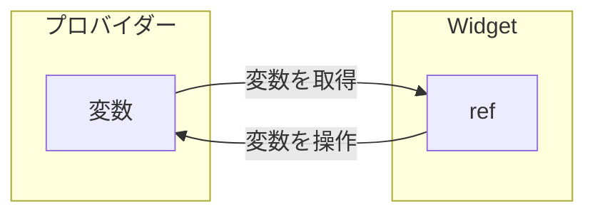

</div>
</div>

<span style="text-decoration-line: underline; text-decoration-color: cyan;">プロバイダーによって変数を提供し、refによってその変数に対して取得・操作する</span>というのがRiverpodのざっくりとした使い方です。

このプロバイダーを使い始めるためには、以下のように一番上の`Widget`を`ProviderScope`で囲む必要があります。\
忘れずに記述しましょう。

```dart
void main() {
  runApp(
    const ProviderScope(
      child: SampleWidget(),
    ),
  );
}
```


---

### プロバイダーの種類

プロバイダーには様々な種類があり、一覧で記述しておきます。\
次頁以降で各プロバイダーの詳細を見ていきましょう。

| Provider | 最も単純なプロバイダー |
| --- | --- |
| NotifierProvider | クラスで提供する値を制御するプロバイダー  |
| FutureProvider | AsyncValue\<T\>を提供するプロバイダー |
| StreamProvider | Streamで変化する値をAsyncValue\<T\>として提供するプロバイダー |
| AsyncNotifierProvider | クラスで提供する値を制御するFutureProvider |
| StreamNotifierProvider | クラスで提供する値を制御するStreamProvider |
| <span style="opacity: 0.6;">ChangeNotifier</span> | <span style="opacity: 0.6;">mutableで複雑な状態管理を行うプロバイダー (※基本的に使用することがない)</span> |

<div style="padding-top: 10px; font-size: 13px; text-align: right; opacity: 0.8;">
(※StateProviderとStateNotifierProviderは旧バージョンで使用されていたもので、現在は非推奨です。)
</div>

---


### プロバイダーの種類：Provider

<div grid="~ cols-2">

<div>

`Provider`を使った基本的なコードを記述します。

<div style="font-size: 15px;">

- Providerが提供する型をジェネリクスに指定しつつ、提供する値を計算する関数を記述する
- `ConsumerWidget`を継承して手に入る`ref`オブジェクトを使って`ref.watch`することで、Providerが提供する値を読み取ることができる

<br/>

</div>


<CodeCaption>Providerの基本のサンプルコード</CodeCaption>

```dart
final sampleProvider = Provider<String>((ref) => 'aaa');

// widget
class SampleWidget extends ConsumerWidget {
  const SampleWidget({super.key});

  Widget build(BuildContext context, WidgetRef ref) {
    return Text(ref.watch(sampleProvider)); // 「aaa」が表示される
  }
}
```

</div>

<div style="display: flex; justify-content: center; padding-top: 1.2em;">

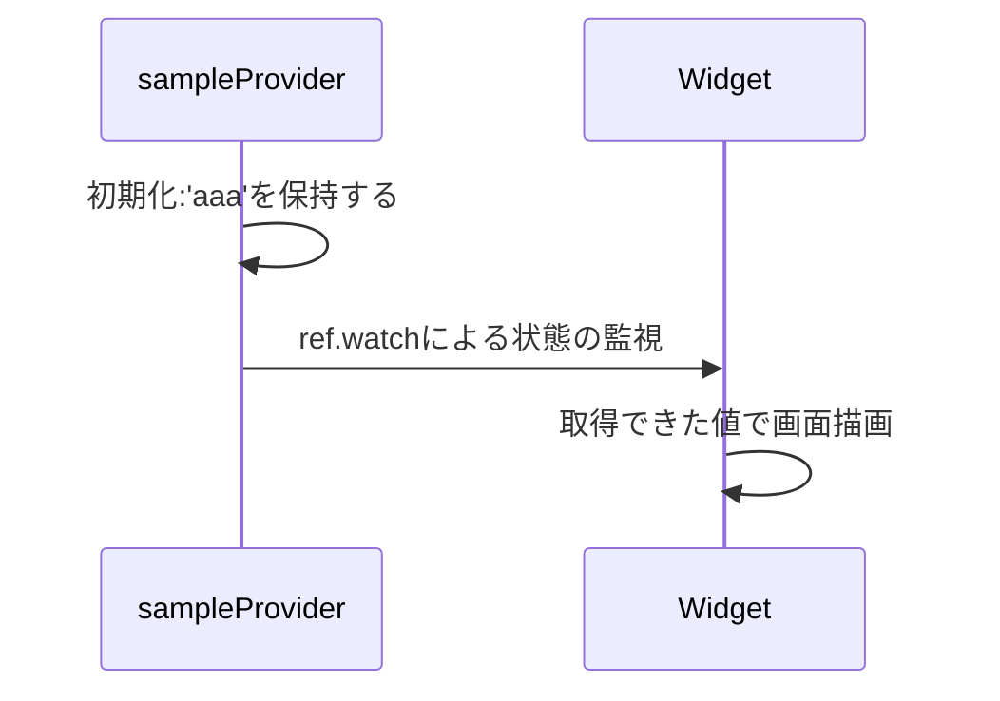

</div>
</div>

しかし、これは一定の値(計算結果)を提供するだけであり、`Provider`だけでは画面を動的に変化させることができません。\
そこで、値を操作するためのメソッドも一緒に提供するプロバイダーがあり、それが次頁で説明する`NotifierProvider`です。


---

### プロバイダーの種類：NotifierProvider

`NotifierProvider`は`Provider`とは違い、<span style="text-decoration-line: underline; text-decoration-color: cyan;">提供する値を更新するメソッドも提供します</span>。\
また、`ref.read(**.notifier)`で提供されるメソッドにアクセスできます。


<CodeCaption>NotifierProviderの基本のサンプルコード: カウンターを表すint型を提供している</CodeCaption>

```dart {1-10|11-19}
final counterProvider = NotifierProvider<CounterNotifier, int>(CounterNotifier.new); // プロバイダーを定義
class CounterNotifier extends Notifier<int> {
  @override
  int build() {
    return 0;
  }
  void increment() {
    state += 1;
  }
}
// Widgetでプロバイダーを使用
TextButton(
  child: Text(
    'カウンター: ${ref.watch(counterProvider)}'
  ),
  onPressed: () {
    ref.read(counterProvider.notifier).increment(); // increment呼び出し
  },
)
```

---

### プロバイダーの種類：NotifierProvider

<div style="display:flex;">

<div style="width:55%;">

前頁のコードで出てきた`state`というのは、プロバイダーが提供する値そのものを指します。\
この`state`を更新することで提供する値に変化が生じます。

そして、`state`を更新するメソッドなどを定義しているのが`notifier`で\
`ref.read(**.notifier)`のように`notifier`にアクセスすることで、メソッドにアクセスできます。

`state`が変化したことは`ref.watch`しているものに通知され、\
<span style="text-decoration-line: underline; text-decoration-color: cyan;">自動で画面を更新してくれます</span>。

右図に前頁例の動作の流れを示しておきます。\
<span style="font-size: 0.8em; opacity: 0.8;">プロバイダーが提供する値の初期化は自動で行われます。</span>

</div>

<div>

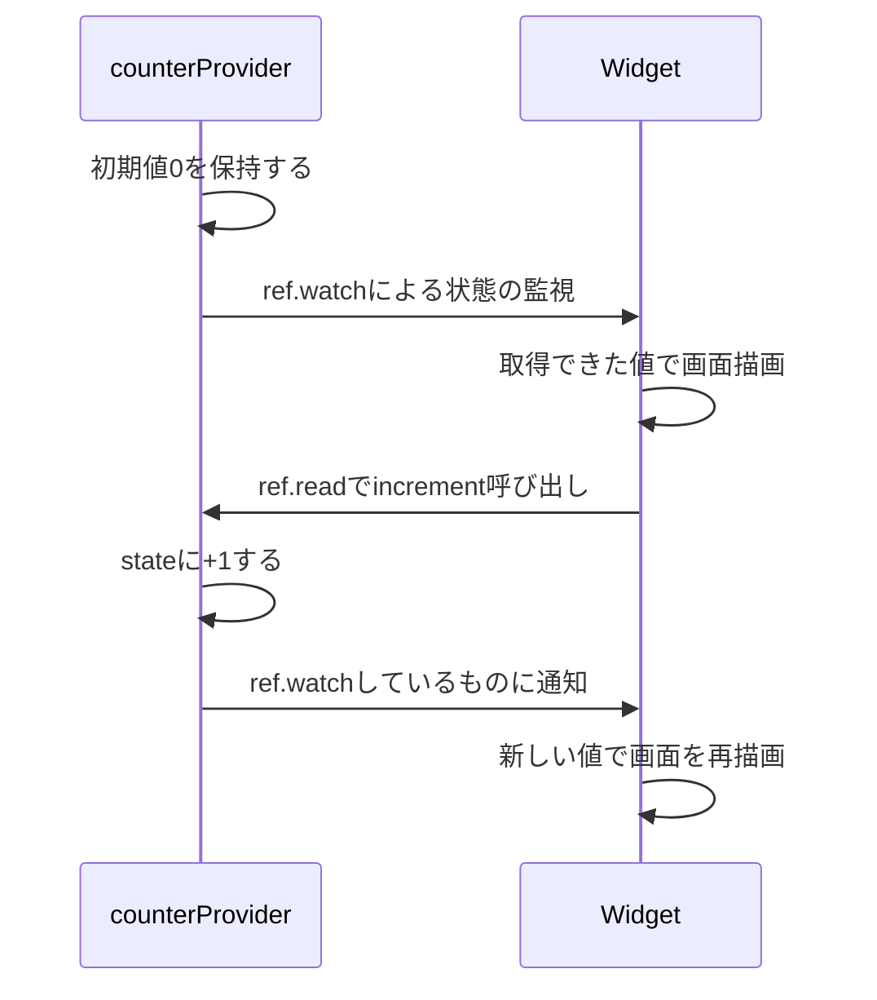

</div>
</div>

---

### プロバイダーの種類：NotifierProvider

`state`と`notifier`、`Widget`の関係は図にすると以下のようになります。

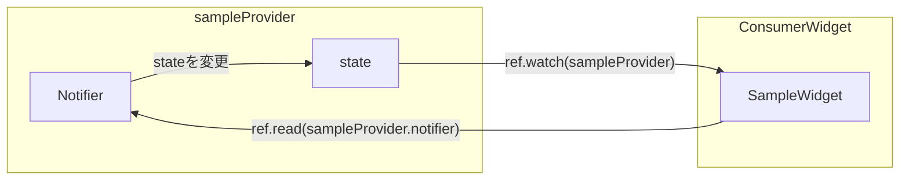

`notifier`に`state`への変更ロジックを記述することで、`Widget`からロジックを切り離して管理できます。

ちなみに、`ref.read(sampleProvider)`のような記述をしても`state`を取得できます。\
しかし、<span style="text-decoration-line: underline; text-decoration-color: red;">`ref.watch`で監視していないと状態が変更されても画面を更新できない</span>ため注意してください。\
とあるメソッド内で現時点の`state`を取得して使用するといった状況以外では、基本的に`ref.watch`を使用することを推奨します。

逆に`notifier`はその場でメソッドを呼び出したいだけで監視する必要がないため、`ref.read`でメソッドにアクセスしています。


---


### プロバイダーの種類：FutureProvider

次に紹介するのは`FutureProvider`です。これまでのプロバイダーだけでは非同期処理を行うのが難しいです。\
この`FutureProvider`は`Provider`のFuture版で、\
非同期的に値を取得するため、<span style="text-decoration-line: underline; text-decoration-color: cyan;">`AsyncValue<T>`</span>として値を提供するプロバイダーです。

<CodeCaption>FutureProviderの基本のサンプルコード</CodeCaption>

```dart
final sampleProvider = FutureProvider<int>((ref) async {
  await Future.delayed(const Duration(seconds: 1)); // 非同期処理を待ってから初期値を返す
  return 10;
});

class SampleWidget extends ConsumerWidget {
  const SampleWidget({super.key});

  @override
  Widget build(BuildContext context, WidgetRef ref) {
    final asyncVal = ref.watch(sampleProvider);
    return switch (asyncVal) {
      AsyncData<int>(:final value) => Text('$value'),
      AsyncError<int>(:final error) => Text('$error'),
      _ => CircularProgressIndicator(),
    };
  }
}
```

---

### プロバイダーの種類：FutureProvider (AsyncValueについて)

`AsyncValue`を一言で表すなら<span style="text-decoration-color: cyan; text-decoration-line: underline;">非同期でデータを取得するときに発生し得る全ての状態を表現するためのクラス</span>です。

<div style="display: flex;">

<div style="width: 60%;">

右図は非同期処理において起こり得る状態遷移を表しています。🤮

図のような非同期処理において起こり得る状態をクラスひとつで表現できるようにしたものが`AsyncValue`ですが、\
すぐに全て把握するのは難しく、まずはざっくりと３つの状態があることを把握しておきましょう。

- データ取得中のとき
- データを保持しているとき
- 取得中にエラーが発生したとき

複雑ですが、どのような状況で画面にどういった情報を表示するかを制御することができるようになるため重要なクラスです。

</div>

<div>

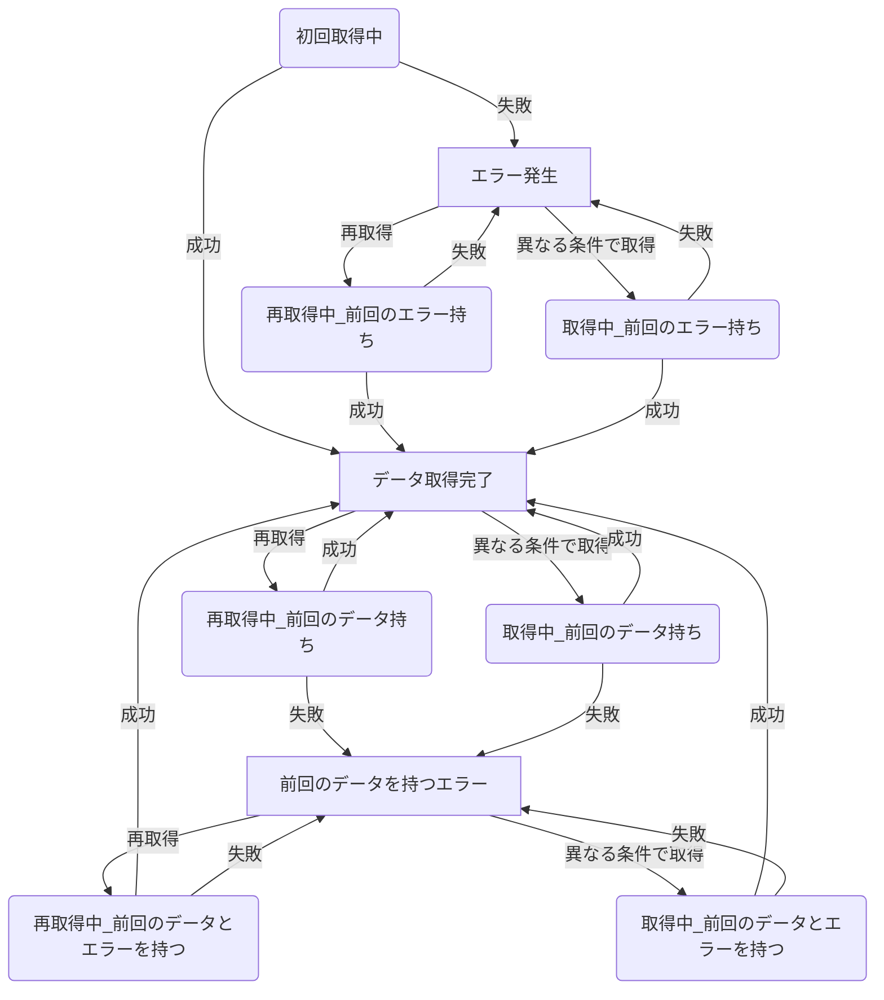

</div>

</div>


---

### プロバイダーの種類：FutureProvider (AsyncValueについて)

`AsyncValue`の正体は抽象クラスで、3つの具象クラスに分けられています。

- `AsyncLoading`: データ取得中のとき
- `AsyncData`: データを保持しているとき
- `AsyncError`: 取得中にエラーが発生したとき

また、それぞれが3つのパラメータを持っています。

- `value`(`hasValue`で存在するかどうかチェックできる)\
  `AsyncData`の場合は常に`null`ではない
- `error`(`hasError`で存在するかどうかチェックできる)\
  `AsyncError`の場合は常に`null`ではなく、`AsyncData`の場合は常に`null`
- `isLoading`\
  `AsyncLoading`の場合は常に`true`

これらを組み合わせて前頁の図のような様々な状態を表現しています。\
`AsyncData`でも`isLoading`が`true`、`AsyncError`でも`isLoading`が`true`などが存在し得ます。

---

### プロバイダーの種類：FutureProvider (AsyncValueについて)

`FutureProvider`の場合、後から値を変更するメソッドがないので、以下の流れを把握できていれば十分です。

<div style="text-align: center;">

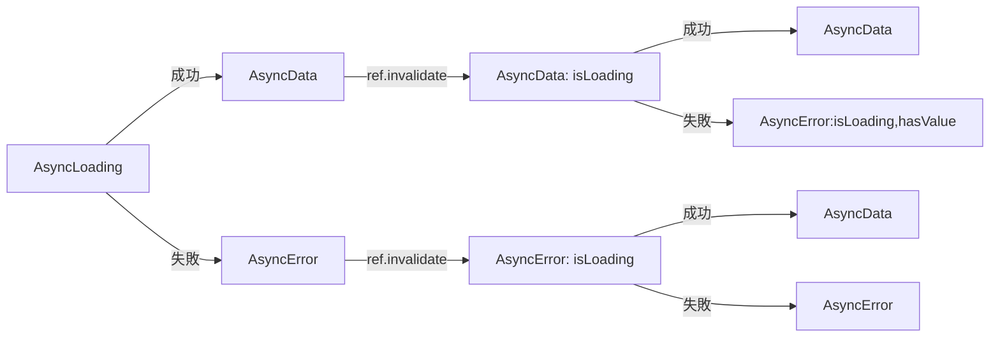

</div>

最初の非同期処理を終えた後`AsyncData`か`AsyncError`になってから、`FutureProvider`を初期化した時に`isLoading`が`true`になり、再度非同期処理を行います。初期化は`invalidate()`を使用します。\
これはプロバイダーの保持している状態をリセットするために使用します。

```dart
ref.invalidate(sampleProvider);
```

---

### プロバイダーの種類：FutureProvider (AsyncValueについて)

初期化して`isLoading`が`true`となっても前回の値は保持されています。\
これは、前回取得できていた値や発生していたエラーを表示しつつ、新しい値を取得中であることを表すためです。

`Widget`側で、受け取った`AsyncValue`を先述の6状態で分岐させて書くには以下のように記述します。

<CodeCaption>switch式による分岐の例：毎回全て書く必要はなく、適宜省略して書いてください</CodeCaption>

```dart
Widget build(BuildContext context, WidgetRef ref) {
  final asyncVal = ref.watch(sampleProvider);
  return switch(asyncVal) {
    AsyncData<String>(:final value, isLoading: false) => Text(value),
    AsyncData<String>(:final value, isLoading: true) => Text('has $value, but isLoading'),
    AsyncError<String>(:final error, isLoading: false) => Text('$error'),
    AsyncError<String>(:final error, isLoading: true, hasValue: false) => Text('has $error, but isLoading'),
    AsyncError<String>(:final error, hasValue: true, :final value?, isLoading: true) => Text('has $error & $value, but isLoading'),
    _ => const CircularProgressIndicator(), // その他
  };
}
```

<div style="font-size: 0.9em; opacity: 0.8;">

dartのswitch式については[こちら](https://dart.dev/language/branches)を参照してください。多少癖がある書き方なので、慣れるまで時間がかかるかもしれません。\
`AsyncValue`を扱う上では頻繁に使用するものなので習得できることが望ましいです。

</div>

---

### プロバイダーの種類：FutureProvider (AsyncValueについて)

switch式で分岐できるようになる前は、以下のように`when`によって分岐させていました。今でも使用されています。

```dart
return asyncVal.when(
  data: (value) => Text('$value'),
  error: (error, stack) => Text('$error'),
  loading: () => const CircularProgressIndicator(),
);
```

`when`では以下の引数によって制御するため、細かく制御するのは面倒でした。

<div style="font-size: 0.8em; opacity: 0.8;">

- `skipLoadingOnReload`: 他のプロバイダーを`ref.watch`していて、依存先が変わった時にloading扱いにしない
- `skipLoadingOnRefresh`: `invalidate`した場合に、loading扱いにしない
- `skipError`: `AsyncError`でも`value`があればdata扱いにする

</div>

```dart
return asyncVal.whenOrNull(
  skipLoadingOnReload: true,
  data: (value) => Text('$value'),
  error: (error, stack) => Text('$error'),
  loading: () => const CircularProgressIndicator(),
);
```

今では、switch式による完全な制御が行えるので、そちらの使用を推奨します。

---

### プロバイダーの種類：StreamProvider

次に紹介するのは`Provider`のStream版です。`FutureProvider`と同じで非同期な値を提供するため、`AsyncValue<T>`として値を提供するプロバイダーです。
Streamについては[こちら](https://dart.dev/tutorials/language/streams)を参照してください。\
`invalidate()`の挙動は`FutureProvider`と同じですが、<span style="text-decoration-line: underline; text-decoration-color: red;">`yield`で値が返った後に次のデータを取得するまでの間の処理中は`isLoading`でも`AsyncLoading`でもないです</span>。次のデータが取得できたら`AsyncData`から`AsyncData`になるだけです。

<div style="display: flex;">

<div style="text-align: center; width: 40%;">

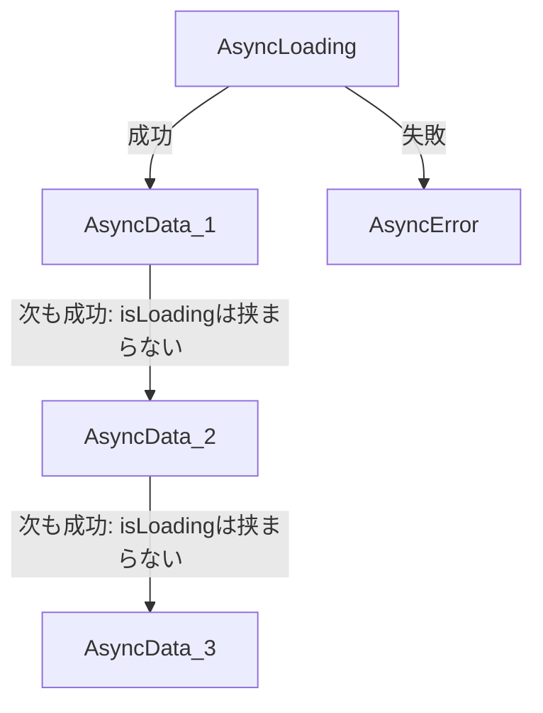

</div>

<div>

```dart
final sampleStreamProvider = StreamProvider<String>((ref) async* {
  final streamList = Stream.fromIterable(['sample', 'sample2', 'sample3']);
  await for (final value in streamList) {
    yield value;
  }
});
class SampleStreamWidget extends ConsumerWidget {
  const SampleStreamWidget({super.key});
  @override
  Widget build(BuildContext context, WidgetRef ref) {
    return switch (ref.watch(sampleStreamProvider)) {
      AsyncData(:final value) => Text(value),
      AsyncError(:final error) => Text(error.toString()),
      _ => const CircularProgressIndicator(),
    };
  }
}
```

</div>
</div>


---

### プロバイダーの種類：AsyncNotifierProvider

次は最も苦戦するであろうプロバイダーです。`AsyncValue`を提供する`NotifierProvider`です。\
`FutureProvider`と違い、取得後に任意のメソッドで`state`に変更を加えることができます。

```dart
final sampleProvider = AsyncNotifierProvider<SampleNotifier, int>(
  SampleNotifier.new,
);
class SampleNotifier extends AsyncNotifier<int> {
  @override
  Future<int> build() async {
    await Future.delayed(const Duration(seconds: 1)); // 非同期処理を待ってから初期値を返す
    return 0;
  }
  void increment() {
    state = state.whenData((data) => data + 1)
  }
}
// widget側
return switch (ref.watch(sampleProvider)) {
  AsyncData<int>(:final value) => Text('$value'),
  AsyncError<int>(:final error) => Text('$error'),
  _ => CircularProgressIndicator(),
};
ref.read(sampleProvider.notifier).increment();
```

---

### プロバイダーの種類：AsyncNotifierProvider

`state`を自由に変更できてしまうため、変更処理には気を付けないといけません。\
<span style="font-size: 0.8em; opacity: 0.8;">例えば、`FutureProvider`では初回の非同期処理中にだけ`AsyncLoading`になっていましたが、
`state`に直接`AsyncLoading()`を代入することで、任意のタイミングで`AsyncLoading`になってしまいます。</span>\
`AsyncValue`を後から変更するための便利なメソッドはいくつか用意されているので、それらを駆使して実装しましょう。

<div grid="~ cols-2 gap-4">

<div>

<CodeCaption>guard: 発生したエラーをAsyncErrorに変換、エラーがなければAsyncDataに変換</CodeCaption>

```dart
state = await AsyncValue.guard<String>(() async {
  await Future<dynamic>.delayed(const Duration(seconds: 1));
  return 'Hello World';
});
```

<br/>

<CodeCaption>copyWithPrevious: 前回の状態を保持して更新</CodeCaption>

```dart
// 再取得前にローディングにする
state = const AsyncLoading<String>().copyWithPrevious(state);
// 条件を変えて取得する前にローディングにする
state = const AsyncLoading<String>().copyWithPrevious(
  state,
  isRefresh: false,
);
```

</div>

<div>

<CodeCaption>whenData: stateがAsyncDataの時だけdataに変更を加える</CodeCaption>
```dart
state = state.whenData((data) {
  final newString = '$data!';
  return newString;
});
```

<br/>

<CodeCaption>unwrapPrevious: 前回までの状態を消す</CodeCaption>

```dart
state = state.unwrapPrevious();
```

</div>
</div>

---

### プロバイダーの種類：AsyncNotifierProvider (AsyncValueについて)

ほとんどの場合、`FutureProvider`で紹介したときの条件分岐ができていれば十分だと思いますが、\
ひとつ注意点があります。

`state = AsyncLoading<T>().copyWithPrevious(state, isRefresh: false);`とすると、前回の値やエラーが保持されることには変わりませんが、
クラスが`AsyncData`や`AsyncError`ではなく、`AsyncLoading`になることに注意してください。\
<span style="font-size: 0.8em; opacity: 0.8;">`state = copyWithPrevious(state);`とすると`AsyncData`か`AsyncError`の`isLoading`が`true`になるだけで、`AsyncLoading`にはならない。</span>

これは、リフレッシュではない（同じ条件での取得でない）と指定していることになっており、
新しい条件で新しい値を取得しようとしているので、<span style="text-decoration-line: underline; text-decoration-color: cyan;">初回取得(`AsyncLoading`)であるように扱われています</span>。
前回の値は`AsyncLoading`の`value`に保持されています。

この挙動はページングのような次のデータを取得する（条件は変わるが前回の値は使う）といった事例で有用です。

`isRefresh`を`true`のまま`copyWithPrevious`で上書きしても保持しているデータが同じだからといって、\
<span style="text-decoration-line: underline; text-decoration-color: red;">雑に全てリフレッシュ扱いとすると、UIとの齟齬が生まれるので複数人で開発するときは特に注意してください。</span>

<div style="font-size: 0.8em; opacity: 0.8;">

`AsyncValue`では、\
クラスが`AsyncData`(or `AsyncError`)で`isLoading`が`true`のときをリフレッシュと呼び、\
クラスが`AsyncLoading`で`value`(or `error`)を保持しているときをリロードと呼んでいます。

</div>

---

### プロバイダーの種類：AsyncNotifierProvider (AsyncValueについて)

内部的に`AsyncValue`を使用しているプロバイダーについては、`invalidate()`によって自動で`isLoading`を`true`にしてくれるなど行ってくれています。\
そのため、やむを得ない場合を除き、直接`AsyncValue`を使用するのは避けましょう。<span style="font-size: 0.9em; opacity: 0.8;">実装者の負担が増えます。😢</span>

<div grid="~ cols-2 gap-4">

<div>

<CodeCaption>推奨：AsyncNotifierProviderの例</CodeCaption>

```dart
final sampleProvider = AsyncNotifierProvider<
  SampleNotifier,
  int
>(SampleNotifier.new);

class SampleNotifier extends AsyncNotifier<int> {
  @override
  Future<int> build() async {
    await Future.delayed(const Duration(seconds: 1));
    return 0;
  }
}
```

</div>

<div>

<CodeCaption>非推奨：NotifierProviderでAsyncValueを直接使用する例</CodeCaption>

```dart
final sampleProvider = NotifierProvider<
  SampleNotifier,
  AsyncValue<int>
>(SampleNotifier.new);

class SampleNotifier extends Notifier<AsyncValue<int>> {
  @override
  AsyncValue<int> build() async {
    return AsyncData(0);
  }
}
```

</div>

</div>


---

### プロバイダーの種類：StreamNotifierProvider

<span style="font-size: 0.9em; opacity: 0.8;">これはあまり使用する場面はないと思いますが、存在していることは紹介しておきます。</span>\
`StreamProvider`の`NotifierProvider`版です。\
Stream処理における状態を管理するための`AsyncValue`を提供する`NotifierProvider`です。

```dart
final sampleProvider = StreamNotifierProvider<SampleNotifier, int>(SampleNotifier.new);

class SampleNotifier extends StreamNotifier<int> {
  @override
  Stream<int> build() async* {
    final streamList = Stream<int>.fromIterable(List<int>.generate(10, (i) => i + 1));
    await for (final val in streamList) {
      await Future.delayed(const Duration(seconds: 1));
      yield val;
    }
  }
}
// widget側
return switch (ref.watch(sampleProvider)) {
  AsyncData<int>(:final value) => Text('$value'),
  AsyncError<int>(:final error) => Text('$error'),
  _ => CircularProgressIndicator(),
};
```

---

### プロバイダー全般の注意点: 定義場所

ここまで紹介してきたプロバイダーについて、いくつか注意点があります。\
まず、プロバイダーを<span style="text-decoration-line: underline; text-decoration-color: red;">必ずグローバルに定義する</span>ようにしてください。\
[Riverpodの公式ドキュメント](https://riverpod.dev/ja/docs/essentials/do_dont)でも指摘されているように、ローカルに定義するとメモリリークなどの原因にになります。

<br/>

<div grid="~ cols-2 gap-4">

<div>

<CodeCaption><span style="color: red; font-weight: bold;">x</span> ローカルに定義した例</CodeCaption>

```dart
class SampleWidget extends ConsumerWidget {
  const SampleWidget({super.key});

  Widget build(BuildContext context, WidgetRef ref) {
    final sampleProvider = Provider<int>((ref) => 0);
    return Text(ref.watch(sampleProvider));
  }
}
```


</div>

<div>

<CodeCaption><span style="color: green; font-weight: bold;">o</span> グローバルに定義した例</CodeCaption>

```dart
final sampleProvider = Provider<int>((ref) => 0);

class SampleWidget extends ConsumerWidget {
  const SampleWidget({super.key});

  Widget build(BuildContext context, WidgetRef ref) {
    return Text(ref.watch(sampleProvider));
  }
}
```


</div>

</div>

---

### プロバイダー全般の注意点: 定義場所

とはいえ、プロバイダーがグローバルに定義されることによって、依存関係が煩雑になりがちです。\
その問題への対処法のひとつを紹介します。それが、<span style="text-decoration-line: underline; text-decoration-color: cyan;">`mixin`</span>を使用することです。

どのプロバイダーがどこの`Widget`からアクセスされているかといった依存関係を整理するために、\
`mixin`を使用して「このクラスにこのプロバイダーが関係している」といったことを、コード上に記述することができるようになります。

記述するかどうかは実装者に委ねられるので明確なものではありませんが、\
プロジェクトで使用を強制してみるなどの検討を行う価値はあると思われます。

```dart
mixin class SampleState {
  int sampleValue(WidgetRef ref) => ref.watch(sampleProvider);
}

class SampleWidget extends ConsumerWidget with SampleState {
  const SampleWidget({super.key});

  @override
  Widget build(BuildContext context, WidgetRef ref) {
    return Text('${sampleValue(ref)}');
  }
}
```


---

### プロバイダー全般の注意点: 参照の更新

次の注意点は、状態変化による画面の自動更新についてです。\
プロバイダーは`ref.watch`することで自動で画面を更新してくれる便利なものですが、\
`state`がクラスのような参照を表すものの場合、<span style="text-decoration-line: underline; text-decoration-color: red;">参照が変更されなければ値が更新されたとして判定されない</span>ことに注意してください。

<div grid="~ cols-2 gap-4">

<div>

<CodeCaption><span style="color: red; font-weight: bold;">x</span> 間違った例</CodeCaption>

```dart
class SampleState {
  SampleState({required this.x});
  int x;
}

final sampleProvider = NotifierProvider<
  SampleStateNotifier,
  SampleState
>(SampleStateNotifier.new);
class SampleStateNotifier extends Notifier<SampleState> {
  @override
  SampleState build() {
    return SampleState(x: 0);
  }
  void increment() {
    state.x += 1; // 参照が更新されないため、watchしても更新されない
  }
}
```

</div>

<div>


<CodeCaption><span style="color: green; font-weight: bold;">o</span> 正しい例</CodeCaption>

```dart
class SampleState {
  const SampleState({required this.x});
  final int x;
}

final sampleProvider = NotifierProvider<
  SampleStateNotifier,
  SampleState
>(SampleStateNotifier.new);
class SampleStateNotifier extends Notifier<SampleState> {
  @override
  SampleState build() {
    return SampleState(x: 0);
  }
  void increment() {
    state = SampleState(x: state.x + 1);
  }
}
```

</div>
</div>

---

### プロバイダー全般の注意点: 参照の更新

こういった参照の更新問題のために、`copyWith`メソッドをクラスに定義しておくことがよくあります。\
([freezed](https://pub.dev/packages/freezed)パッケージを使用すると`copyWith`など便利なメソッドを生成できます。)

```dart
@immutable
class SampleState {
  const SampleState({required this.x, required this.y});
  final int x;
  final int y;
  SampleState copyWith({int? x, int? y}) {
    return SampleState(x: x ?? this.x, y: y ?? this.y);
  }
}

final sampleProvider = NotifierProvider<SampleStateNotifier, SampleState>(SampleStateNotifier.new);
class SampleStateNotifier extends Notifier<SampleState> {
  @override
  SampleState build() {
    return SampleState(x: 0, y: 0);
  }
  void increment() {
    state = state.copyWith(x: state.x + 1); // 参照が更新されるため、UIも更新される
  }
}
```

---

### プロバイダー全般の注意点: 更新中の更新

3つ目の注意点です。\
プロバイダーは初期化時に`ref`を取得できますが、その時に別のプロバイダーを更新することはしないでください。\
してしまったらエラーになります。設計など見直しましょう。\
どうしても更新する必要があるときは`WidgetsBinding.instance.addPostFrameCallback`を使用してください。\
これは、次のフレームが描画された後に実行される関数を記述できます。

<div grid="~ cols-2 gap-4">

<div>

<CodeCaption><span style="color: red; font-weight: bold;">x</span> 誤っているコード例</CodeCaption>

```dart
final sampleProvider = NotifierProvider<
  SampleNotifier,
  int>(SampleNotifier.new);
class SampleNotifier extends Notifier<int> {
  @override
  int build() {
    // プロバイダーの更新中に他のプロバイダーを更新はダメ
    ref.read(otherProvider.notifier).increment();
    return 0;
  }
  void increment() {
    state += 1;
  }
}
```

</div>

<div>

<CodeCaption><span style="color: green; font-weight: bold;">o</span> 正しいコード例</CodeCaption>

```dart
final sampleProvider = NotifierProvider<
  SampleNotifier,
  int>(SampleNotifier.new);
class SampleNotifier extends Notifier<int> {
  @override
  int build() {
    WidgetsBinding.instance.addPostFrameCallback((_) {
      ref.read(otherProvider.notifier).increment();
    });
    return 0;
  }
  void increment() {
    state += 1;
  }
}
```

</div>
</div>

---


### 各プロバイダーに付与できる修飾子について

プロバイダーには`autoDispose`と`family`という修飾子を付与でき、効果は以下の通りです。

<div style="font-size: 0.9em;">

- `autoDispose`\
  `ref.watch`するものがいなくなると保持している状態を破棄し、メモリを解放する
- `family`\
  外部のパラメータで別々のプロバイダーを作成できるようになる <span style="font-size: 0.8em; opacity: 0.8;">(例：IDによって別のプロバイダーとして使用するなど)</span>

</div>

<div grid="~ cols-2 gap-2" style="margin-top: 10px;">

<div>

<CodeCaption>autoDispose例</CodeCaption>

```dart
final sample1Provider = Provider.autoDispose<int>(
  (ref) => 10,
);

final sample2Provider = NotifierProvider.autoDispose<
  Sample2Notifier,
  int
>(Sample2Notifier.new);

class Sample2Notifier extends AutoDisposeNotifier<int> {
  @override
  int build() => 0;
}
```

</div>
<div>

<CodeCaption>family例</CodeCaption>

```dart
final sample3Provider = Provider.family<int, String>(
  (ref, arg) => 10, // arg(String)によって別の値を返すなど
);

final sample4Provider = NotifierProvider.family<
  Sample4Notifier,
  int,
  String
>(Sample4Notifier.new);

class Sample4Notifier extends FamilyNotifier<int, String> {
  @override
  int build(String arg) => 0; // argによって別の値を返すなど
}
```

</div>
</div>

---

### 各プロバイダーに付与できる修飾子について: autoDispose

プロバイダーはグローバルに定義するため、普通に定義していると常にメモリを使い続けます。\
そのため、基本的に<span style="text-decoration-line: underline; text-decoration-color: cyan;">プロバイダーには`autoDispose`を付与する</span>ことを推奨します。

逆に`autoDispose`を付与したプロバイダーは`ref.watch`しているものがいなくなったときに値を破棄してしまいます。\
`Widget`内の必要なところで`ref.watch`することはもちろんのこと、<span style="text-decoration-line: underline; text-decoration-color: red;">条件分岐で`ref.watch`が実行されなくなっても監視していないと判定されて破棄される</span>ことに注意してください。

<div grid="~ cols-2 gap-4">

<div>

<CodeCaption>sampleProviderが破棄される可能性があるコード</CodeCaption>

```dart
class SampleWidget extends ConsumerWidget {
  const SampleWidget({super.key, required this.isWatch});
  final bool isWatch;

  @override
  Widget build(BuildContext context, WidgetRef ref) {
    if (isWatch) {
      return Text(ref.watch(sampleProvider));
    } else {
      return Text('sample');
    }
  }
}
```

</div>

<div>

<CodeCaption>sampleProviderが破棄されないように書いた例</CodeCaption>

```dart
class SampleWidget extends ConsumerWidget {
  const SampleWidget({super.key, required this.isWatch});
  final bool isWatch;

  @override
  Widget build(BuildContext context, WidgetRef ref) {
    final val = ref.watch(sampleProvider);
    if (isWatch) {
      return Text(val.toString());
    } else {
      return Text('sample');
    }
  }
}
```

</div>
</div>

---

### 各プロバイダーに付与できる修飾子について: autoDispose(onDispose)

`autoDispose`を付与すると自動でメモリを解放しますが、このようなプロバイダーが解放される時にメソッドを呼び出すことができます。\
どのプロバイダーでも、初期化時に`ref.onDispose`を使用して記述します。

<div grid="~ cols-2 gap-4">

<div>

<CodeCaption>Provider.autoDispose</CodeCaption>

```dart
final sampleProvider = Provider.autoDispose<int>(
  (ref) {
    ref.onDispose(() {
      print('dispose!');
    });
    return 10;
  }
);
```

</div>
<div>

<CodeCaption>NotifierProvider.autoDispose</CodeCaption>

```dart
class SampleNotifier extends AutoDisposeNotifier<int> {
  @override
  int build() {
    ref.onDispose(() {
      print('dispose!');
    });
    return 10;
  }
}
```

</div>
</div>

<br/>

<div style="font-size: 0.7em; opacity: 0.6;">
(例: 通信のキャンセルやCloseなどを行うことが多いです。
<span style="text-decoration-line: underline; text-decoration-color: red;">
TextEditingControllerなどのController系のdisposeには使用せず、後述するFlutterHooksを使用してください
</span>。)
</div>


---

### 各プロバイダーに付与できる修飾子について: family

familyを使用することで、外部のパラメータで別々のプロバイダーを作成できるようになります。\
パラメータで同じようなプロバイダーを複製するといったイメージです。<span style="font-size: 0.8em; opacity: 0.8;">(例：IDによって別のプロバイダーとして使用するなど)</span>\
読み取るときは`ref.watch(sampleProvider(id))`のように、パラメータを渡して取得します。

<CodeCaption>family例</CodeCaption>

```dart
final sampleProvider = FutureProvider.family<int, String>(
  (ref, id) async {
    final res = await dio.get('sample_api/$id'); // idによって別の値を返すなどの処理
    return res.data.toString();
  },
);

class SampleWidget extends ConsumerWidget {
  const SampleWidget({super.key, required this.id});
  final String id;

  @override
  Widget build(BuildContext context, WidgetRef ref) {
    return Text(ref.watch(sampleProvider(id))); // `ref.watch(sampleProvider)`としないように注意する
  }
}
```

---

### 各プロバイダーに付与できる修飾子について: family

familyに渡すことができるパラメータはひとつだけなので、複数渡したいときはクラスとして定義して渡すか、<span style="text-decoration-line: underline; text-decoration-color: cyan;">Record</span>を使用します。\
Recordは匿名の構造体のようなものです。詳細は[公式](https://dart.dev/language/records)を参照してください。

名前付きでないRecordも当然渡せますが、名前付きで渡したほうが可読性が高まるのでおすすめです。

<CodeCaption>Recordを使用する例</CodeCaption>

```dart
final sampleProvider = Provider.family<String, ({String id, String name})>((ref, ({String id, String name}) arg) {
  return 'sample_${arg.id}_${arg.name}';
});

final sampleNotifierProvider = NotifierProvider.family<SampleNotifier, String, ({String id, String name})>(SampleNotifier.new);
class SampleNotifier extends FamilyNotifier<String, ({String id, String name})> {
  @override
  String build(({String id, String name}) arg) {
    return 'sample_${arg.id}_${arg.name}';
  }
}

// widget
Text(ref.watch(sampleProvider((id: '1', name: '2'))))
Text(ref.watch(sampleNotifierProvider((id: '1', name: '2'))))
```


---

### 各プロバイダーに付与できる修飾子について: autoDisposeとfamilyの併用

また、autoDisposeとfamilyは併用することが可能です。\
IDによって異なるプロバイダーを作成し、`ref.watch`していないIDのプロバイダーは破棄する、といったことができます。

<CodeCaption>FutureProviderの例</CodeCaption>

```dart
final sampleProvider = FutureProvider.autoDispose.family<int, String>( // 連結して記述するだけ
  (ref, id) async {
    return await sampleCalc(id);
  }
);
```

<CodeCaption>NotifierProviderの例</CodeCaption>

```dart
final sampleProvider = NotifierProvider.autoDispose.family<
  SampleNotifier,
  int,
  String
>(SampleNotifier.new);

class SampleNotifier extends AutoDisposeFamilyNotifier<int, String> { // 親クラス名はAutoDisposeが先になっている
  @override
  int build(String arg) => 0;
}
```


---

### refの使い方

プロバイダーにアクセスするための`ref`の使い方で、これまで`read`・`watch`・`invalidate`を紹介してきました。\
ほとんどの場合この３つで事足りると思いますが、他にも`ref`の使い方があるのでここで一覧で示しておきます。

<div style="font-size: 0.9em;">

- ref.read: プロバイダーの値を取得する
- ref.watch: プロバイダーの提供する値を監視して、変更があれば再構築する
- ref.invalidate: プロバイダーを再初期化する
- ref.invalidateSelf: 自分自身のプロバイダーをinvalidateする
- ref.listen: プロバイダーの提供する値を監視して、変更があれば任意の関数を実行する
- ref.listenSelf: 自分自身のプロバイダーの提供する値を監視して、変更があれば任意の関数を実行する

</div>


```dart
ref.read(sampleProvider); // or ref.read(sampleProvider.notifier).method();
ref.watch(sampleProvider);
ref.invalidate(sampleProvider);
ref.invalidateSelf(); // プロバイダー内で記述する
ref.listen(sampleProvider, (previous, next) {
  print('previous: $previous, next: $next');
});
ref.listenSelf((previous, next) { // プロバイダー内で記述する
  print('previous: $previous, next: $next');
});
```

<div style="font-size: 0.8em; text-align: right; opacity: 0.7;">ref.listenManualとref.refreshは非推奨</div>


---
layout: section
---

## Flutter Hooks

---

### FlutterHooksによる状態管理

これまで紹介したRiverpodのプロバイダーではグローバルに定義されているため、基本的に`Widget`全体で共有されます。\
[FlutterHooks](https://pub.dev/packages/flutter_hooks)では特定の`Widget`の内部だけで管理できる変数の定義を`use~~`で行うことができます。\
`StatelessWidget`ではなく、<span style="text-decoration-line: underline; text-decoration-color: cyan;">`HookWidget`を継承する</span>ことで使用できるようになります。

<div style="display: flex;">

<div style="width: 52%">

<CodeCaption>Hooksの使用例</CodeCaption>

```dart
class SampleWidget extends HookWidget {
  const SampleWidget({super.key});
  Widget build(BuildContext context) {
    final isEnabledField = useState<bool>(false);
    return Column(children: [
      TextButton(
        child: Text('toggle'),
        onPressed: () {
          isEnabledField.value = !isEnabledField.value // 更新
        },
      ),
      TextField(
        enabled: isEnabledField.value, // 参照
      ),
    ])
  }
}
```

</div>

<div style="padding-left: 10px;">

<CodeCaption>refと一緒に使う例: HookConsumerWidgetを継承する</CodeCaption>

```dart
class SampleWidget extends HookConsumerWidget {
  const SampleWidget({super.key});

  Widget build(BuildContext context, WidgetRef ref) {
    ref.watch(sampleProvider);
    final isSample = useState<bool>(true);
    return Text(isSample.value ? 'sample' : 'foobar');
  }
}
```

<div style="font-size: 0.8em; opacity: 0.5; padding-top: 16px; text-align: right;">

HooksはReactを使ったことがある人にとっては馴染み深いかもしれません。

</div>

</div>
</div>

---

### FlutterHooksの使いどころ

わざわざHooksを使用しなくても全部プロバイダーで管理すればと思うかもしれませんが、\
Riverpodはあくまで<span style="text-decoration-line: underline; text-decoration-color: cyan;">`Widget`間の共通の状態を管理するために設計されています</span>。\
画面ひとつで完結してロジックも持たないような状態までプロバイダーで管理しようとすると、グローバルに定義しなければならない縛りがある以上、管理が複雑になっていきます。\
さらに、別の`Widget`から状態を変更されると困るのであれば、管理がより一層厳しくなります。
<span style="font-size: 0.8em; opacity: 0.8;">\
例えば、とあるパスワード入力欄でパスワードの表示・非表示の切り替えや、`TextEditingController`などのController系、アニメーションの制御など、どうやっても1画面で完結するような状態の管理はRiverpodには向いていません。\
</span>

もちろん、何でもかんでもHooksで記述するのも、それはそれで管理が難しくなるので控えましょう。\
どちらを積極的に使用するか（しないか）は、各プロジェクトの方針に従うようにしてください。

また、Hooksには単純に変数の管理のために使用する`useState`の他に、`useEffect`や`useMemoized`などが存在します。\
全てのuse系は紹介できませんので、詳細は[FlutterHooksの公式](https://pub.dev/packages/flutter_hooks#existing-hooks)を参照してください。

ここでは頻繁に見かける<span style="text-decoration-line: underline; text-decoration-color: cyan;">`useState`</span>・<span style="text-decoration-line: underline; text-decoration-color: cyan;">`useMemoized`</span>・<span style="text-decoration-line: underline; text-decoration-color: cyan;">`useTextEditingController`</span>・<span style="text-decoration-line: underline; text-decoration-color: cyan;">`useEffect`</span>を紹介していきます。

---

### FlutterHooks: useState

`useState`は`HookWidget`で使用できる最も単純な状態管理方法です。\
参照も更新も`.value`をつけるだけでいつもの記述方法で行うことができます。

```dart
class SampleWidget extends HookWidget {
  const SampleWidget({super.key});

  @override
  Widget build(BuildContext context) {
    final isSample = useState<bool>(true); // build内でuseState
    return TextButton(
      // .valueで値を取り出す
      child: Text(isSample.value ? 'sample' : 'foobar'),
      onPressed: () {
        // .valueに対して代入することで状態が更新され、Widgetが再描画される
        isSample.value = !isSample.value;
      },
    );
  }
}
```

簡単ですね😊


---

### FlutterHooks: useMemoized

`useMemoized`は値をキャッシュして、何度も同じ計算をすることを防ぐことができます。\
アルゴリズムをかじったことがある人は聞き覚えがあるかもしれませんが、いわゆる<span style="text-decoration-line: underline; text-decoration-color: cyan;">メモ化</span>です。\
第一引数に関数、第二引数に一時保持するためのKeyを渡します。Keyが変われば再計算されます。\
第二引数に`const []`のようなものを渡すと2度と再計算されません。

```dart
class SampleWidget extends HookWidget {
  const SampleWidget({super.key});

  @override
  Widget build(BuildContext context) {
    final expensiveCalculation = useMemoized(() => expensiveCalculation(), const []);
    return Text(expensiveCalculation.toString());
  }
}
```

使用している画面そのものが破棄されるとメモ化された値も破棄されるので、アプリで<span style="text-decoration-line: underline; text-decoration-color: red;">永続化されるわけではない</span>ことに注意してください。

`FromState`の`GlobalKey`を作成するなどにも使用されており、汎用性は高いです。
```dart
final formKey = useMemoized(GlobalKey<FormState>.new, const []);
```

---

### FlutterHooks: Controller

`TextEditingController`などが代表する、Flutterで出てくるController系は\
`StatefulWidget`で使用することを前提としているため、`StatelessWidget`では基本的に使用できません。\
そこで、`HookWidget`を使用することでControllerを`StatefulWidget`なしで定義・使用できるようになります。

```dart
class SampleWidget extends HookWidget {
  const SampleWidget({super.key});

  Widget build(BuildContext context) {
    final editingController = useTextEditingController(); // 他のControllerも同じような書き方
    return TextField(
      controller: editingController,
    );
  }
}
```

<span style="text-decoration-line: underline; text-decoration-color: cyan;">Controllerは`Widget`と同じライフサイクルであるべき</span>であるため、`HookWidget`を使用することを強く推奨します。\
HooksはWidgetと同じライフサイクルで管理してくれるため最適です。

<div style="font-size: 0.9em; opacity: 0.9;">

<span style="text-decoration-line: underline; text-decoration-color: red;">RiverpodではControllerを管理しない</span>ようにしてください。\
Widgetとは異なるライフサイクルで管理しているため、`dispose()`忘れなどで最悪メモリリークなどを発生させる可能性があります。

</div>


---

### FlutterHooks: use**Controllerを自作する

既存のController以外にも、パッケージなどで定義されているControllerもあるでしょう。\
これらについても自分で`use`を使用して`use~~Controller`を定義できます。

```dart
SampleController useSampleController() {
  return use(const _SampleController());
}

class _SampleController extends Hook<SampleController> {
  const _SampleController();
  @override
  _SampleController createState() => _SampleControllerState();
}
class _SampleControllerState extends HookState<SampleController, _SampleController> {
  final SampleController _controller = SampleController();
  @override
  SampleController build(BuildContext context) {
    return _controller;
  }
  @override
  void dispose() {
    super.dispose();
  }
}
```

---

### FlutterHooks: useEffect

`useEffect`は他とは少し違って、`Widget`のライフサイクルに合わせて任意の処理を実行させることができるものです。

第二引数に与えるKeyが変わる時に実行されるというのは`useMemoized`と同じですね。

<div grid="~ cols-2 gap-4">

<div>

<CodeCaption>useEffectの内容</CodeCaption>

```dart
useEffect(
  () {
    // 与えるKeyが変わる時に実行される処理を記述
    return () {
      // Widgetが破棄される時に実行される処理
    };
  },
  [ /*任意の値*/ ],
);
```

</div>

<div>

<CodeCaption>使用例</CodeCaption>

```dart
// アニメーションコントローラー用のHooks
final animationController = useAnimationController(
  duration: const Duration(seconds: 1),
);

useEffect(
  () {
    // 初回だけアニメーションさせる
    animationController.forward();
    return null;
  },
  const [],
);
```

</div>
</div>

---

### Riverpodで管理している状態をFlutterHooksと連携する

では、ここまでの内容を踏まえて、ひとつの例を記述してみます。\
プロバイダーで入力値を保持しながら、それが別のところから更新されたときにもControllerの値を同期させるという状況を考えてみます。
もし以下のコードがスラスラと読めるのであれば、状態管理にも十分慣れている証拠でしょう。👏

```dart {all|2|3|4,5,12-14|6-11|15-18|all}
Widget build(BuildContext context, WidgetRef ref) {
  final controller = useTextEditingController(); // step1: コントローラーを作成
  final currentState = ref.watch(sampleProvider); // step2: プロバイダーの値を監視
  useEffect(
    () {
      WidgetsBinding.instance.addPostFrameCallback((timeStamp) { // step4: フレーム描画後にcontrollerの値をプロバイダーの値と一致させる
        if (controller.text != currentState) { // 遅延実行なので、ここで必ずしも違うわけではないため再度チェック
          controller.text = currentState;
        }
      });
      return null;
    },
    [controller.text != currentState], // step3: プロバイダーの値が変わり、controller.textの値と異なる場合に実行
  );
  return TextField(
    controller: controller,
    onChanged: ref.read(sampleProvider.notifier).updateState, // step5: 入力値に従ってプロバイダーの値を更新するTextFieldを定義
  );
}
```


---
layout: section
---

## パフォーマンス考慮

---

### constによる再描画判定の阻止

ここからは状態管理におけるパフォーマンス改善のお話です。まずは最も単純なところです。

`Widget`のコンストラクタでLinterに`const`を付けるように注意されている場合、`const`をつけておきましょう。\
`Widget`インスタンスが使い回されることで、ある程度のパフォーマンス改善が期待できるため必ず実施してください。

その他にもLinterによって注意されている部分については、可能な限り対応しておきましょう。

```dart
class SampleWidget extends StatelessWidget {
  const SampleWidget({super.key});

  @override
  Widget build(BuildContext context) {
    return Scaffold(
      appBar: AppBar(
        title: const Text('Sample Title'), // ここも
      ),
      body: const Center( // ここも
        child: Text('sample text'),
      ),
    );
  }
}
```


---

### Riverpodのパフォーマンス向上: refの範囲を絞る

小さな範囲で`ref`を使うことで、再構築処理を行う範囲を狭めることができます。\
例えば、`ConsumerWidget`を継承するclassを分割して定義することで範囲を絞ることができます。\
しかし、classを細かく定義しすぎると可読性が下がるため、`Consumer`を使用することも検討してください。

<div grid="~ cols-2 gap-4">

<div>

<CodeCaption>ConsumerWidget継承例</CodeCaption>
```dart
class Sample1Widget extends StatelessWidget {
  @override
  Widget build(BuildContext context) {
    return Column(
      children: [
        const Text('sample'),
        const Sample2Widget(),
      ],
    );
  }
}
class Sample2Widget extends ConsumerWidget {
  const SampleWidget({super.key});
  @override
  Widget build(BuildContext context, WidgetRef ref) {
    return Text(ref.watch(sampleProvider));
  }
}
```

</div>

<div>

<CodeCaption>Consumer使用例</CodeCaption>

```dart
class SampleWidget extends StatelessWidget {
  @override
  Widget build(BuildContext context) {
    return Column(
      children: [
        Consumer(
          builder: (context, ref, child) {
            return Text(ref.watch(sampleProvider));
          },
        ),
        const Text('sample'),
      ],
    );
  }
}
```

</div>
</div>

---

### Riverpodのパフォーマンス向上: selectを使用する

`select`を使用して必要な値だけを監視することで、必要最低限の時だけ再構築するようにします。\
以下コード例では`x`だけを監視しており、`SampleState`の参照が変わったり`y`が変わったりしても更新されないようになります。

```dart
class SampleState {
  const SampleState({
    required this.x,
    required this.y,
  });
  final int x;
  final int y;
}
// sampleProviderはSampleStateを提供するProvider
// 詳細は省略する
class SampleWidget extends ConsumerWidget {
  const SampleWidget({super.key});
  @override
  Widget build(BuildContext context, WidgetRef ref) {
    return Text(
      ref.watch(sampleProvider.select((val) => val.x.toString())),
    );
  }
}
```

---

### Riverpodのパフォーマンス向上: Providerを挟む

考え方は`select`と同じで、UI側で必要とする部分だけを監視するために`Provider`を挟みます。\
これは`select`と違って、複雑な計算が必要になる場合などで使用することが多いです。

`select`だと`Widget`内で記述することになるため、ロジックを書かなければならない場合にはこの方法が適しています。

```dart
final calcResultProvider = Provider<String>((ref) {
  var tmp = ref.watch(sampleProvider);
  // ここで複雑な計算やフィルタ処理などを行う
  return tmp.x.toString();
});

class SampleWidget extends ConsumerWidget {
  const SampleWidget({super.key});

  @override
  Widget build(BuildContext context, WidgetRef ref) {
    return Text(ref.watch(calcResultProvider));
  }
}
```

---

### Riverpodのパフォーマンス向上: selectAsyncを使用する

`select`では`AsyncValue`を監視するときに記述量が多くなり面倒になりがちです。\
そこで、`selectAsync`を使用することでFutureを取得することができるのでこれも活用してみましょう。

```dart
final sampleProvider = FutureProvider<int>((ref) async {
  await Future.delayed(const Duration(seconds: 1));
  return 10;
});

final sample2Provider = FutureProvider<String>((ref) async {
  final sample = await ref.watch(sampleProvider.selectAsync((val) => val));
  return (sample * 2).toString();
});

class SampleWidget extends ConsumerWidget {
  const SampleWidget({super.key});

  @override
  Widget build(BuildContext context, WidgetRef ref) {
    return Text(ref.watch(sample2Provider));
  }
}
```

---


### FlutterHooksのパフォーマンス向上

考え方はプロバイダーの`select`と同様で、再描画処理の範囲を狭めるために可能な限り小さな範囲で`use**`を使用しましょう。\
また、細かくしすぎると読みづらいコードになるので、HookBuilderの使用も検討してください。

<div grid="~ cols-2 gap-4">

<div>

<CodeCaption>class分割例</CodeCaption>

```dart
class SampleHookWidget extends HookWidget {
  const SampleHookWidget({super.key});

  @override
  Widget build(BuildContext context) {
    final isEnabled = useState<bool>(false);
    final controller = useTextEditingController();
    return TextField(
      enabled: isEnabled.value,
      controller: controller,
    );
  }
}
```
</div>

<div>

<CodeCaption>HookBuilder使用例</CodeCaption>

```dart
class SampleHookWidget extends StatelessWidget {
  const SampleHookWidget({super.key});

  @override
  Widget build(BuildContext context) {
    return HookBuilder(
      builder: (context) {
        final isEnabled = useState<bool>(false);
        final controller = useTextEditingController();
        return TextField(
          enabled: isEnabled.value,
          controller: controller,
        );
      },
    );
  }
}
```

</div>
</div>

---
layout: section
---

## 画面遷移(Navigation)

---


### 画面遷移について

さて、ここまでで状態管理について学んできましたが、複数画面のあるアプリケーションを作る場合は、当然画面遷移が必要になります。\
Flutterの画面遷移について軽く学びましょう。

Flutterでは最初、単純なスタックを使った画面遷移をサポートしていました。

<div style="font-size: 0.6em; display: flex; align-items: center; gap: 10px; padding-top: 10px; padding-bottom: 10px;">

<div style="display: flex; flex-direction: column; align-items: center; border: 2px solid gray; width: 128px; border-top: none;">
<div style="opacity: 0; border: 1px solid gray; padding: 5px; width: 120px; text-align: center;">NewPage2</div>
<div style="opacity: 0;border: 1px solid gray; padding: 5px; width: 120px; text-align: center;">NewPage1</div>
<div style="opacity: 1;border: 1px solid gray; padding: 5px; width: 120px; text-align: center;">BasePage</div>
</div>

<div style="font-size: 2em; display: flex; flex-direction: column; align-items: center; justify-content: center; width: 50px;">
  <div>→</div>
  <div style="font-size: 0.5em;">push</div>
</div>

<div style="display: flex; flex-direction: column; align-items: center; border: 2px solid gray; width: 128px; border-top: none;">
<div style="opacity: 0; border: 1px solid gray; padding: 5px; width: 120px; text-align: center;">NewPage2</div>
<div style="opacity: 1;border: 1px solid gray; padding: 5px; width: 120px; text-align: center;">NewPage1</div>
<div style="opacity: 1;border: 1px solid gray; padding: 5px; width: 120px; text-align: center;">BasePage</div>
</div>

<div style="font-size: 2em; display: flex; flex-direction: column; align-items: center; justify-content: center; width: 50px;">
  <div>→</div>
  <div style="font-size: 0.5em;">push</div>
</div>

<div style="display: flex; flex-direction: column; align-items: center; border: 2px solid gray; width: 128px; border-top: none;">
<div style="opacity: 1; border: 1px solid gray; padding: 5px; width: 120px; text-align: center;">NewPage2</div>
<div style="opacity: 1;border: 1px solid gray; padding: 5px; width: 120px; text-align: center;">NewPage1</div>
<div style="opacity: 1;border: 1px solid gray; padding: 5px; width: 120px; text-align: center;">BasePage</div>
</div>

<div style="font-size: 2em; display: flex; flex-direction: column; align-items: center; justify-content: center; width: 50px;">
  <div>→</div>
  <div style="font-size: 0.5em;">pop</div>
</div>

<div style="display: flex; flex-direction: column; align-items: center; border: 2px solid gray; width: 128px; border-top: none;">
<div style="opacity: 0; border: 1px solid gray; padding: 5px; width: 120px; text-align: center;">NewPage2</div>
<div style="opacity: 1;border: 1px solid gray; padding: 5px; width: 120px; text-align: center;">NewPage1</div>
<div style="opacity: 1;border: 1px solid gray; padding: 5px; width: 120px; text-align: center;">BasePage</div>
</div>

<div style="font-size: 2em; display: flex; flex-direction: column; align-items: center; justify-content: center; width: 50px;">
  <div>→</div>
  <div style="font-size: 0.5em;">replace</div>
</div>

<div style="display: flex; flex-direction: column; align-items: center; border: 2px solid gray; width: 128px; border-top: none;">
<div style="opacity: 0; border: 1px solid gray; padding: 5px; width: 120px; text-align: center;">NewPage1</div>
<div style="opacity: 1;border: 1px solid gray; padding: 5px; width: 120px; text-align: center;">NewPage2</div>
<div style="opacity: 1;border: 1px solid gray; padding: 5px; width: 120px; text-align: center;">BasePage</div>
</div>

</div>

```dart
Navigator.push(context, MaterialPageRoute(builder: (context) => NewPage()));
Navigator.pop(context);
```

このようなコードでページを追加して画面遷移していました。

ですが、この単純な方法のページ遷移では様々な問題があります。\
一番の問題はディープリンクです。特定のページへ直接移動する手法がスタックの遷移では難しかったのです。

そこで改良されたものが<span style="text-decoration-line: underline; text-decoration-color: cyan;">Router(Navigator2.0)</span>です。\
<span style="font-size: 0.8em; opacity: 0.8;">ちなみに、この単純なスタックによる画面遷移についてはNavigator(Navigator1.0)と呼ばれ、現在でも使用でき、Routerと併用できます。</span>

---

### Navigator 2.0

しかし、改良版であるRouterは、そのまま使うには複雑すぎてNavigatorのように簡単には扱えないです。😭

<div style="display: flex;">

<div style="width: 38%;">

[右図](https://qiita.com/vsuine/items/9cf7c2dc9f94b16d85ae)には、Navigator2.0で実装するメソッドの流れが示されているのですが、すぐに理解できる人は少ないでしょう。

この複雑さを隠蔽してくれるパッケージが作成されています。😎\
メジャーなのは以下の２つです。

- [go_router](https://pub.dev/packages/go_router): 公式で使用が推奨されている
- [auto_route](https://pub.dev/packages/auto_route)

<span style="font-size: 0.8em; opacity: 0.8;">しかし、より複雑な制御をする時はこのようなパッケージではできないこともあります。いずれRouterを理解する必要が出てくるかもしれません。少し詳しく書かれてる[記事](https://qiita.com/vsuine/items/9cf7c2dc9f94b16d85ae)を載せておきます。</span>


</div>

<div>

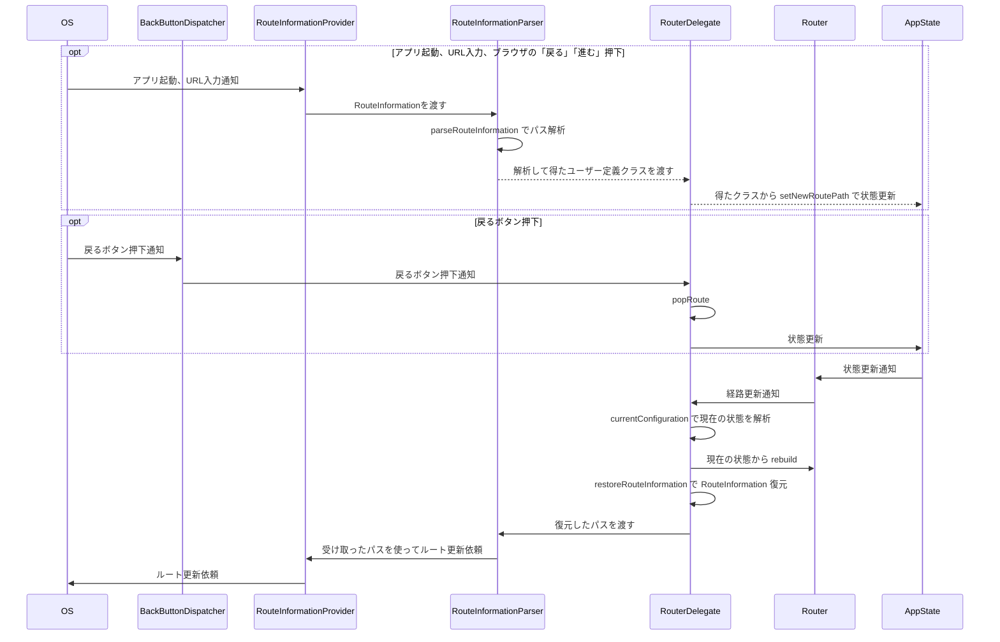

</div>
</div>

---

### go_routerの使用例

go_routerでは、先にどのようなページ遷移があるかを事前に記述してから、その遷移先を指定することで画面遷移を行います。\
[公式のコード例](https://pub.dev/packages/go_router/example)のままですが、以下のようになります。例を見つつ実装してみましょう。


````md magic-move
```dart
// step1: まずは画面を用意する
class HomeScreen extends StatelessWidget {
  ...
}
class DetailsScreen extends StatelessWidget {
  ...
}
```
```dart
class HomeScreen extends StatelessWidget { ... }
class DetailsScreen extends StatelessWidget { ... }
// step2: ページの構成を記述する
final GoRouter _router = GoRouter(
  routes: <RouteBase>[
    GoRoute(
      path: '/',
      builder: (BuildContext context, GoRouterState state) {
        return const HomeScreen();
      },
      routes: <RouteBase>[
        GoRoute(
          path: 'details',
          builder: (BuildContext context, GoRouterState state) {
            return const DetailsScreen();
          },
        ),
      ],
    ),
  ],
);
```
```dart
// step3: MaterialAppをMaterialApp.routerにして、routerConfigに渡す
class HomeScreen extends StatelessWidget { ... }
class DetailsScreen extends StatelessWidget { ... }
final GoRouter _router = GoRouter(...)

class MyApp extends StatelessWidget {
  const MyApp({super.key});

  @override
  Widget build(BuildContext context) {
    return MaterialApp.router(
      routerConfig: _router,
    );
  }
}
void main() => runApp(const MyApp());
```
```dart
// step4: context.goで画面遷移するコードを記述する
class HomeScreen extends StatelessWidget {
  const HomeScreen({super.key});

  @override
  Widget build(BuildContext context) {
    return Scaffold(
      appBar: AppBar(title: const Text('Home Screen')),
      body: Center(
        child: ElevatedButton(
          onPressed: () => context.go('/details'),
          child: const Text('Go to the Details screen'),
        ),
      ),
    );
  }
}
```
````

---
layout: section
---

## Flutterのテスト

---

### Flutterのテストの基本

ここまでで実装だけならできるようになったと思います。実際にアプリを作ってみるといいでしょう。\
ですが、実装だけでなくテストも重要です。Flutterにおけるテストには以下のようなものがあります。

<div style="font-size: 0.9em;">

| 単体テスト(Unit Test) | コードの最小単位である関数やメソッドをテストする |
| --- | --- |
| ウィジェットテスト(Widget Test) | ウィジェットの描画やイベント処理をテストする |
| 統合テスト(Integration Test) | 複数のコンポーネントが組み合わされた状態でのテスト |

</div>

<br/>

テスト用のコードはtestディレクトリの中に配置し、名前は`*_test.dart`という名前にします。

```
├── lib
└── test
    └── unit
        └── sample_test.dart
```

`*_test.dart`という名前にしないとテストとして認識されないので注意しましょう。


---

### 単体テスト

単体テストはコードの最小単位である関数やメソッドをテストするものです。一番単純なものですね。

`equals`などはMatcherと呼ばれるもので、`expect`の引数に渡してあげることでテストを行うことができます。\
Matcherの種類は多すぎるので、都度[こちら](https://api.flutter.dev/flutter/package-matcher_matcher/package-matcher_matcher-library.html)から確認しましょう。

<CodeCaption>単体テストの例</CodeCaption>

```dart
void main() {
  test('sample function test', () {
    final sample = SampleClass();
    expect(sample.sampleFunction(3), equals(6));
    expect(sample.sampleFunction(1), equals(2));
  });
}
```

<div style="display: flex;">
<div style="width: 65%; padding-right: 32px;">

テストの実行は以下のようにコマンドで実行するか、\
VSCodeのテストボタンから実行できます。

```bash
flutter test test/unit/sample_test.dart
```

</div>
<div style="padding-top: 16px;">


</div>
</div>

---

### 単体テスト: プロバイダーを使用する

`ProviderContainer`というものを使用して、プロバイダーをテストすることもできます。

```dart
ProviderContainer createContainer({
  ProviderContainer? parent,
  List<Override> overrides = const [],
  List<ProviderObserver>? observers,
}) {
  final container = ProviderContainer(
    parent: parent,
    overrides: overrides,
    observers: observers,
  );
  // containerのdisposeが行われるようにする
  addTearDown(container.dispose);
  return container;
}

void main() {
  test('sample provider test', () async {
    final container = createContainer();
    // containerでreadする
    expect(container.read(sampleProvider), equals(100));
  });
}
```

---

### Widgetテスト

Widgetテストは、`Widget`の描画やイベント処理をテストするものです。\
基本的には`Finder`で`Widget`を探して、その`Widget`が存在するかどうかや、タップなどのイベントをシミュレートして結果が正しいかどうかをテストします。

`Finder`や`Matcher`など、テストに関連する情報は必要な時に[公式ページ](https://docs.flutter.dev/cookbook/testing/widget/introduction)を見返すようにすると良いでしょう。

```dart
class SampleWidget extends ConsumerWidget {
  const SampleWidget({super.key});

  @override
  Widget build(BuildContext context, WidgetRef ref) {
    return Text('100');
  }
}

void main() {
  testWidgets('SampleWidget test', (WidgetTester tester) async {
    await tester.pumpWidget(
      const MaterialApp(home: SampleWidget()), // MaterialAppで囲んでおくと良い
    );
    expect(find.text('100'), findsOneWidget); // 100のテキストを持つWidgetが1つだけあることを確認
  });
}

```

---

### Widgetテスト: プロバイダーを使用する

<div grid="~ cols-2 gap-6">

<div>

プロバイダーを使用している場合は、`ProviderScope`で囲むことで、`Widget`テストでもプロバイダーを使用できるようになります。

```dart
void main() {
  testWidgets('SampleWidget', (WidgetTester tester) async {
    await tester.pumpWidget(
      const ProviderScope(
        child: MaterialApp(home: SampleWidget()),
      ),
    );
    expect(find.text('100'), findsOneWidget);
  });
}
```

</div>

<div>

また、プロバイダーのモックを作るには、以下のようにoverrideを使用します。

```dart
final sampleProvider = Provider<int>((ref) => 100);

void main() {
  test('sample provider test', () async {
    await tester.pumpWidget(
      const ProviderScope(
        child: MaterialApp(home: SampleWidget()),
        overrides: [
          sampleProvider.overrideWith((ref) => 200),
        ],
      ),
    );
    expect(find.text('200'), findsOneWidget);
  });
}
```

</div>
</div>

---

### Notifierのモックは作らない

Notifierを直接モックするのではなく、Notifierが依存している抽象をモックすることでテストします。\
以下のようにNotifierをRepositoryに依存させることで、テストではRepositoryをoverrideします。

```dart
final repositoryProvider = Provider<Repository>(
  (ref) => throw UnimplementedError(),
);
abstract class Repository {
  Future<int> fetch();
}

final sampleProvider = NotifierProvider<SampleStateNotifier, int>(SampleStateNotifier.new);
class SampleStateNotifier extends Notifier<int> {
  @override
  int build() {
    return 0;
  }
  Future<void> fetch() async {
    final res = await ref.read(repositoryProvider).fetch();
    state = state.whenData((data) => data + res);
  }
}
```

プロバイダーのテストについて、より詳細な情報が必要であれば[こちら](https://riverpod.dev/ja/docs/essentials/testing)を参照してください。


---
layout: section
---

## おわりに

---

### おわりに

ここまでお疲れ様でした。🎉🎉🎉\
最低限Flutterでアプリを開発することができるようになったのではないでしょうか。\
最初にも言った通り、実際にアプリを作成しながら知識を深めていくことを推奨しています。\
更新の激しい技術であるため、このチュートリアルだけでなく、学び続けることを心がけましょう。

### 困ったときは

公式サイト・検索・AIChatのWeb検索機能で聞くなどしましょう。

AIChatでは古い情報も多く扱われるため、変化の激しい技術では間違った知識を回答することも珍しくありません。\
誤情報・非推奨の情報などが出てくることに注意しましょう。

また、公式を見ると新しい発見や思いがけないミスを見つけることがあります。
時間があれば積極的に見てみましょう。

[Flutter](https://flutter.dev)・[Riverpod](https://riverpod.dev/ja/)・[FlutterHooks](https://pub.dev/packages/flutter_hooks)


---
layout: intro
---

# おまけ

以降はチュートリアルの域を逸脱していますが、理解を深めるための一助になれば幸いです。

---
layout: section
---

## 描画の仕組み


---

### 具体的な描画の仕組み

これまで使ってきた`Widget`は画面の設定を行っているものであり、実は描画を行っているのは`Widget`ではありません。\
結論を言えば、<span style="text-decoration-line: underline; text-decoration-color: cyan;">`Widget`に対応する`Element`が`RenderObject`に命令して描画しています。</span>\
Flutterには`Widget`ツリー以外に`Element`ツリーと`RenderObject`ツリーが存在しており、それぞれ以下のような関係です。

- `Widget`ツリーはあくまでUIを構築するための設定を持つ程度であり、その設定に対応するように`Element`ツリーが存在する
- `Element`ツリーは`Widget`ツリーと1対1に対応しており、`Widget`ツリーの設定を反映した状態になる\
  実際の状態(変数)を`StateObject`として持つ
- `RenderObject`ツリーは`Element`によって生成され、画面への描画を担当する\
  これは`Element`と1対1に対応しているわけではない

<br/>

<div grid="~ cols-3 gap-6">

<div>

<CodeCaption>Widgetツリー: ただの設定</CodeCaption>

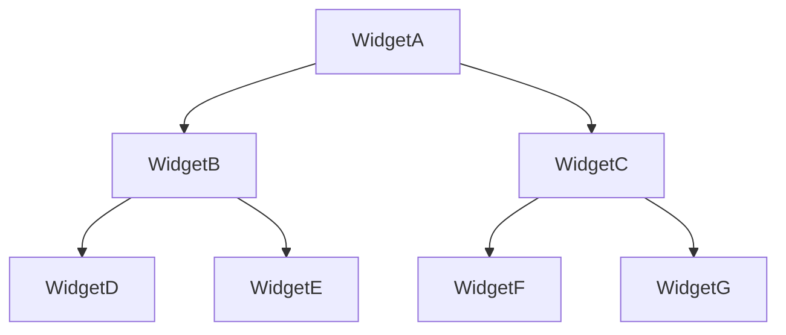
</div>

<div>

<CodeCaption>Elementツリー: 実際に状態管理と描画命令を行う</CodeCaption>

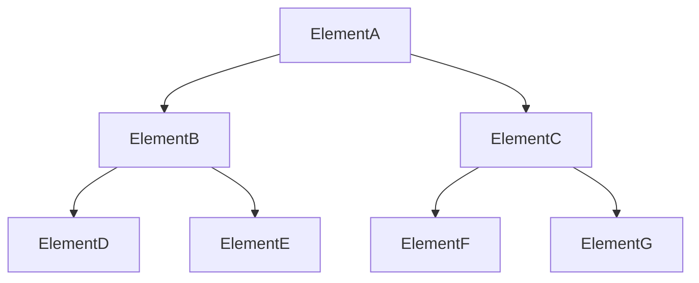

</div>

<div>

<CodeCaption>RenderObjectツリー: 実際に描画処理を実行する</CodeCaption>

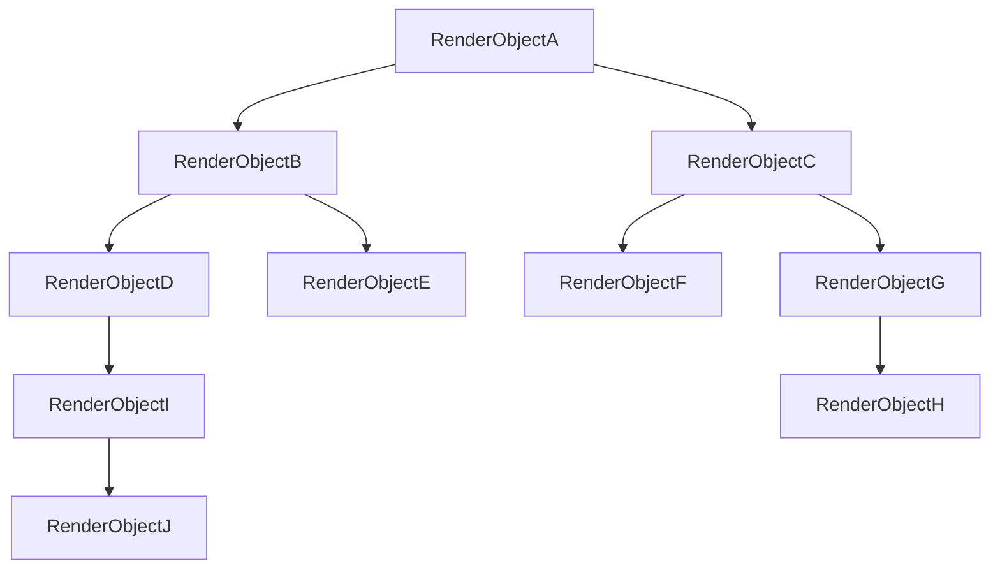

</div>
</div>

---

### 具体的な描画の仕組み

前述した通り`Widget`は所詮設定を持つ程度であるため、実は`Widget`そのものの再構築はたいしたコストになりません。\
一番コストになるのは`Element`の再構築です。

これは`Element`が実際に状態を管理していたり、`Widget`や`RenderObject`も管理していたりと、\
様々な役割を持つオブジェクトであるためです。

つまり、パフォーマンスの最適化のためには<span style="text-decoration-line: underline; text-decoration-color: cyan;">`Element`の再構築を最小限に抑える</span>ことが重要となります。

以下は更新時の挙動です。これを念頭に置いて、次頁でパフォーマンス改善方法の意味を考えましょう。

1. `Element`は`StateObject`に変化があるとdirtyとしてマークする
2. マークされた箇所は次フレームで`Widget`の`build`を呼び出し、`Widget`ツリーを再構築する
3. 最新の`Widget`ツリーのそれぞれの`Widget`で、**位置・runtimeType・keyを比較**して、同一のものかどうかを判断する
4. 同一であれば対応する`Element`は使いまわし、異なれば新しい`Element`を生成する\
  (`Element`が新しくなったとき、`RenderObject`も新しく生成される)

---

### 具体的な描画の仕組み: パフォーマンスについて考える

Elementツリーの再構築を抑えるためには、以下のことを行います。

- そもそもdirtyとしてマークされないようにする\
  <span style="font-size: 0.8em;">Consumerやクラス分割で`ref`の範囲を狭めることで、必要最低限のdirtyマークで済む\
  selectを使って監視する値を絞り、dirtyマークされる条件を減らす</span>
- マークされたときに、比較対象を減らす\
  <span style="font-size: 0.8em;">constをつけるとWidgetの比較がそれより下のWidgetでは行われなくなる</span>
- 頻繁な`Widget`ツリーの再構築を減らす\
  <span style="font-size: 0.8em;">ifによる条件分岐でWidgetを構築すると、条件に当てはまるときと当てはまらないときで`Element`も再生成される\
  これを防ぐために`Visibility`などを使用してツリー構造の変更を減らす\
  非表示な状態がほとんどの場合は、`Visibility`を使用するよりも`if`を使用して、そもそも`Element`を構築しないほうが良いこともある</span>
- `Key`を適切に使用して、`Widget`の同一性を明確にする\
  <span style="font-size: 0.8em;">`Key`が違えば別の`Widget`として扱われて`Element`を再構築する必要が出てくるため、基本は`Key`をつけない</span>

`Element`の再構築を抑えるという視点で実装すると、他にも方法があるかもしれません。\
より良いパフォーマンスのためには`Element`(と`RenderObject`)を意識してみると良いでしょう。

---
layout: section
---

## Macroについて

---

### Dart言語のMacro

Dart言語では、Macroが2025年初頭に正式に導入されると[予告](https://dart.dev/language/macros)されています。(執筆は2024/09)\
マクロというのは、Dart言語においては以下のようになるとされています。

<CodeCaption>アノテーションをつけることで、toJsonとfromJsonが使用できるようになる例</CodeCaption>

```dart
@JsonCodable
class Example {
  final String name;
  final int age;
}

void main() {
  final tmp = Example.fromJson({'name': '名前', 'age': 10});
  final json = tmp.toJson();
}
```

Macroとはこのようにアノテーションによるコード展開（生成）機能です。

これと同じ機能は現在`build_runner`というパッケージを使用し、事前にコマンドを実行してコードを生成することで実現しています。
```bash
dart run build_runner build
```


---

### Dart言語のMacro

実はRiverpodにも`build_runner`による生成機能を[riverpod_generator](https://pub.dev/packages/riverpod_generator)によって使用できます。

にも関わらずgeneratorバージョンを紹介しなかった理由は2つあります。

- コード生成を使用するとほとんどが隠蔽されてしまい、具体的にどうなっているかが分かりづらくなるためチュートリアルに適していない
- build_runnerは不評で、Macro版になってから使えば良いと考えているから

2点目について、Riverpod公式も[コード生成について](https://riverpod.dev/ja/docs/concepts/about_code_generation)以下のように言及しています。

> 現在、コード生成はがオプションなのはbuild_runnerが多くの人に好まれないためです。\
> しかし、[Static Metaprogramming](https://github.com/dart-lang/language/issues/1482)が Dart で利用可能になると、 build_runnerはもはや問題ではありません。\
> その時点で、コード生成を使用することが Riverpod で唯一の方法になるでしょう。

[Dart言語のMacro](https://dart.dev/language/macros)は既に実験的に導入されており、気になる人は触れてみても良いと思います。
